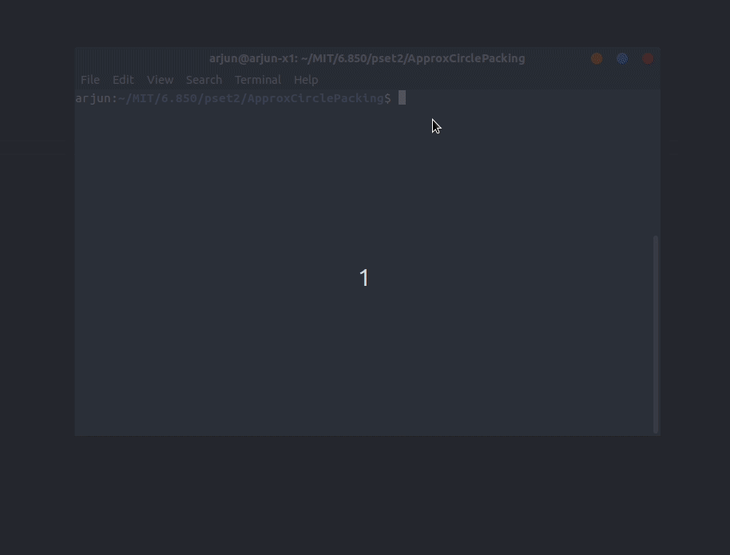

# ApproxCirclePacking
A repository for the 6.850 pset 2 coding problem to implement approximate circle packing.

# Instructions for Running
On command line you can run `circle_packing.py --help` to get command line options for setting 
radius, bin_size, and the number of circles:

```bash
$ python circle_packing.py --help
usage: circle_packing.py [-h] [--radius RADIUS] [--bin_size BIN_SIZE]
                         [--num_circles NUM_CIRCLES]

optional arguments:
  -h, --help            show this help message and exit
  --radius RADIUS       pick the radius for the circles.
  --bin_size BIN_SIZE   pick the bin size.
  --num_circles NUM_CIRCLES
                        pick number of circles.
```

To run with default settings you can directly run:

```bash
$ python circle_packing.py --help
```

The expected output is a random simulation with 100 randomly selected points as described by the default parameters.


The visualization follows the approximate circle packing algorithm by randomly overlaying a grid over the circles, removing circles that are cut by a grid line (marked in red), and then solving the approximate circle pattern separately for each grid cell.

# License

This work uses an MIT License.
